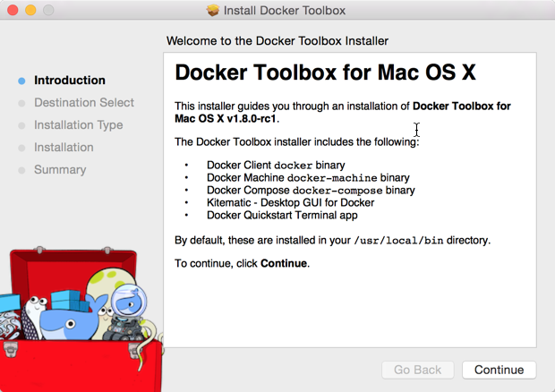
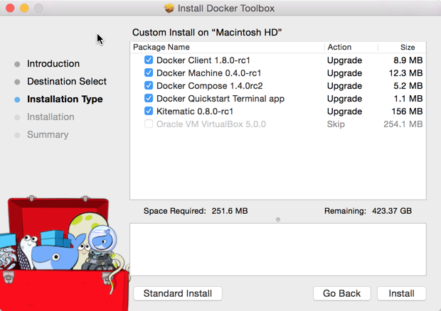
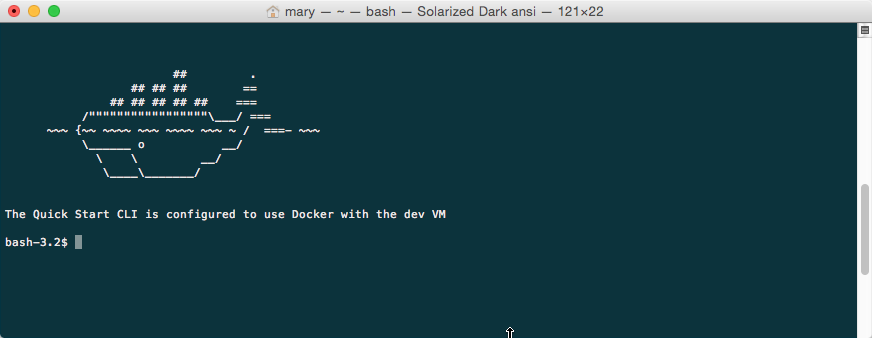
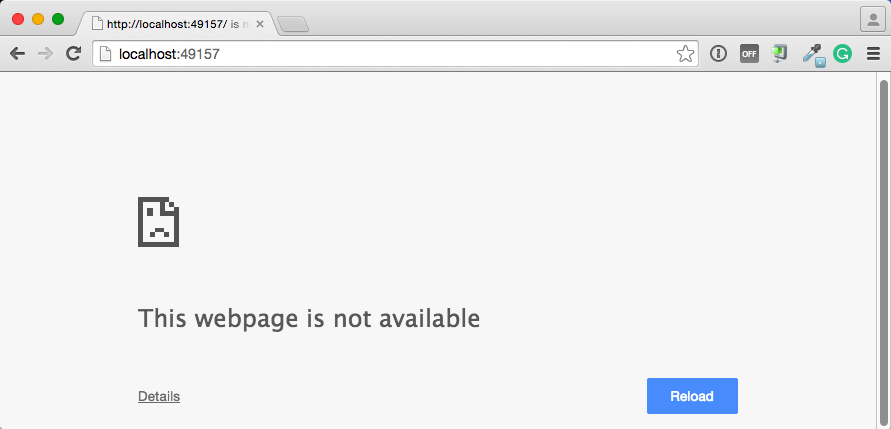
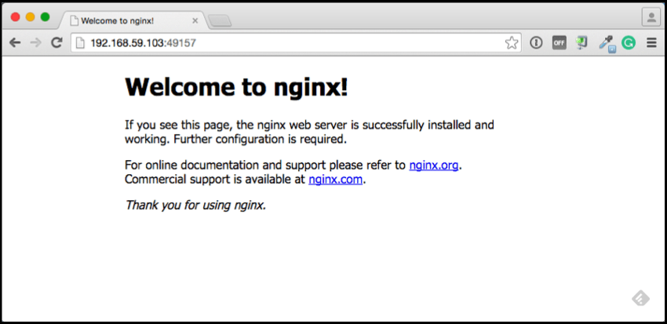
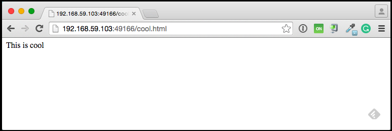

Mac OS X 安装 Docker
===

> 注意：
> 该 Docker 版本为了支持 Docker 机,于是不再支持 Boot2Docker 命令行。使用 Docker Toolbox 和其它 Docker 工具来安装 Docker 机。

您可以利用 Docker Toolbox 来安装 Docker。Docker Toolbox 提供了以下工具：

* 用于运行 docker-machine 二进制文件的 `Docker Machine`
* 用于运行 docker 二进行文件的 `Docker Engine`
* 用于运行 docker-compose 二进行文件的 `Docker Compose (Mac 特有)`
* Kitematic，Docker 的图形用户界面
* 用于 Docker 命令行环且预先配置好的 shell
* Oracle VM VirtualBox

由于 Docker 的后台程序使用了 Linux 特有的内核特性，所以您不能直接在 OS X 上运行 Docker。相反，您必须使用 `docker-machine` 来创建并附加一台虚拟机（VM）。该虚拟机需要安装 Linux 操作系统以便在您 Mac 机上运行 Docker。

####前提条件

您 Mac 机的 OS X 版本必须大于等于 10.8 "Snow Leopard" 才可以安装 Docker Toolbox。

###在安装之前先来了解一些关键概念

当我们在一台 Linux 主机上安装完 Docker 之后，我们的机器中就包含了本地主机和 Docker 主机。如果从网络层来划分，本地主机就代表你的电脑，而 Docker 主机就是运行 container 的那台机器。

在 Linux 机器上的一种典型安装 Docker 方法：Docker 客户端，Docker 后台程序和 container 会直接运行在您的机器上。这就意味着您可以使用标准的本地主机寻址（例如 `localhost:8000` 或者 `0.0.0.0:8376`）来为 Docker container 分配一个地址。


在 OS X 上安装的 Docker ，其 Docker 后台程序是运行在一个名为 `default` 的 Linux 虚拟机上的。`default` 是 Linux 上的一个轻量级的虚拟机，是专门用于在 Mac OS X 机器上运行 Docker 的。


在 OS X 中，Docker 主机地址就是 Linux 虚拟机的地址。当你使用 `docker-machine` 启动虚拟机的时候，该虚拟机会自动获取到 IP 地址。当您开启一个 container 的时候，container 上的端口会映射到虚拟机的端口上。本页面上的实践操作会一一印证上述内容。

###安装

如果您有一个正在运行着的 VirtualBox，那么请您在运行安装器（Docker Toolbox）之前务必关闭它。

1. 进入 [Docker Toolbox](https://www.docker.com/toolbox) 页面。

2. 点击 Docker Toolbox 下载链接，进行下载。

3. 双击安装包或者通过右击并在快捷菜单中选择“打开”的方式安装 Docker Toolbox。

   此时会弹出“Install Docker Toolbox”（安装 Docker 工具箱）窗口。

   

4. 点击“继续”（Continue），安装 toolbox。
  
   此时，toolbox 会展现给你一些选项，供您自定义标准安装。
 
   

   默认情况下，标准的 Docker Toolbox 安装是这样的：
   * 向 `/usr/local/bin` 目录中添加 Docker 工具的二进制文件。
   * 修改权限使得这些二进制文件可供任何用户使用。
   * 更新现有的 VirtualBox 安装。
   
   <br/>
   通过点击“自定义”或“更改安装目录”修改这些默认安装值。

5. 点击“安装”，执行标准安装。
 
   系统提示您输入密码。

   

6. 输入密码，继续安装
   
   安装完成后，Docker Toolbox 会为您提供一些信息，通过这些信息您可以完成一些常见的任务。 

7. 点击“关闭”，离开当前窗口。
  
##运行 Docker Container

想要运行一个 Docker 容器，你需要做如下内容：
* 创建一个新的（或开启一台已存在的）Docker 虚拟机
* 从您当前的环境切换到新的虚拟机的环境中
* 利用 `docker` 客户端创建，加载并管理 container

一旦您创建了一台虚拟机，您就可以随时使用它。如同任意一台 VirtualBox 虚拟机，在每次使用它的时候都会保存其配置。

这里提供两种使用 Docker Toolbox 的方法：使用 Docker 的快速入门终端或使用您的 shell 环境。

###使用 Docker 的快速入门终端
1. 打开“应用程序”文件夹或“启动面板”。
2. 找到 Docker 快速入门终端并双击启动它。

   该应用程序：
   * 开启一个终端窗口
   * 如果还没有虚拟机的化，请创建一台名叫 `default` 的虚拟机；如果已经存在这样一台虚拟机，请你开启它。
   * 将当前终端环境切换到虚拟机环境中。
   
   一旦启动完成，Docker 快速入门终端会是如下状态：
 
   
   现在，您可以运行 `docker` 命令了。

3. 通过运行 `hello-world` container 来核实您的安装是否成功。


   ```
   $ docker run hello-world
   Unable to find image 'hello-world:latest' locally
   511136ea3c5a: Pull complete
   31cbccb51277: Pull complete
   e45a5af57b00: Pull complete
   hello-world:latest: The image you are pulling has been verified.
   Important: image verification is a tech preview feature and should not be
   relied on to provide security.
   Status: Downloaded newer image for hello-world:latest
   Hello from Docker.
   This message shows that your installation appears to be working correctly.


   To generate this message, Docker took the following steps:
   1. The Docker client contacted the Docker daemon.
   2. The Docker daemon pulled the "hello-world" image from the Docker Hub.
      (Assuming it was not already locally available.)
   3. The Docker daemon created a new container from that image which runs the
      executable that produces the output you are currently reading.
   4. The Docker daemon streamed that output to the Docker client, which sent it
      to your terminal.


   To try something more ambitious, you can run an Ubuntu container with:
   $ docker run -it ubuntu bash


   For more examples and ideas, visit:
   http://docs.docker.com/userguide/
   ```


一个可以和 Docker 工具进行交互的另一种典型方法就是：从您的 shell 命令行入手。

###使用shell 命令行
该部分假设您正在运行一个 Bash shell。您运行的可能是不同的 shell，例如 C shell，但是不用担心，命令都是一样的。

1. 创建一个新的 Docker 虚拟机。

   ```
   $ docker-machine create --driver virtualbox default      

   Creating VirtualBox VM...
   Creating SSH key...
   Starting VirtualBox VM...
   Starting VM...
   To see how to connect Docker to this machine, run: docker-machine env default
   ``` 
  
   这就在 VirtualBox 中创建了一台新的 `default` 虚拟机。
   
   该命令还会在 `~/.docker/machine/machines/default` 目录下生成一个 docker machine 的配置文件。您只需执行一次 `create` 命令。然后，您可以使用 `docker-machine` 命令来开启，停止，查询并管理虚拟机。

2. 列出所有可用的 docker machine。
   
   ```
   $ docker-machine ls
   NAME                ACTIVE   DRIVER       STATE     URL                         SWARM
   default             *        virtualbox   Running   tcp://192.168.99.101:2376  
   ```
   如果您之前安装了现在已经舍弃了的 Boot2Docker 这个应用程序的话或者您运行了 Docker 快速入门终端，在列表中还会有一个 `dev` 虚拟机。当   您创建 `default` 虚拟机的时候，`docker-machine` 命令给出了一些指导，以便您您连接虚拟机。

3. 获取 `default` 虚拟机的环境变量

   ```
   $ docker-machine env default
   export DOCKER_TLS_VERIFY="1"
   export DOCKER_HOST="tcp://192.168.99.101:2376"
   export DOCKER_CERT_PATH="/Users/mary/.docker/machine/machines/default"
   export DOCKER_MACHINE_NAME="default"
   # Run this command to configure your shell: 
   # eval "$(docker-machine env default)"
   ```

4. 连接到 `default` 虚拟机

   ```
   $ eval "$(docker-machine env default)"
   ```

5. 运行 `hello-world` container 来验证您的安装是否已经成功。

   ```
   docker run hello-world
   ```

##学习 Toolbox 安装

Toolbox 将 Docker Engine 的可执行文件和 Docker 的可执行文件下载到您的系统中。当您使用 Docker 快速入门终端或手动创建一个 `default` 虚拟机的时候，Docker Machine 会更新 `~/.docker/machine/machines/default` 文件。该文件夹中包含了虚拟机的配置文件。

您可以利用 Docker Machine 在系统中创建多个虚拟机，那么也就会有多个虚拟机的配置文件。如果您想要删除某台虚拟机，请您使用 `docker-machine rm <machine-name>` 命令。

##从 Boot2Docker 迁移
如果您现在用的还是 Boot2Docker 的话，在您的本地系统中还会有一个 `boot2docker-vm` 虚拟机。为了允许 Docker Machine 管理该台虚拟机，你可以对它进行迁移。
1. 打开一个终端或 Docker 的命令行界面。
2. 输入以下命令。

   ```
   docker-machine create -d virtualbox --virtualbox-import-boot2docker-vm boot2docker-vm docker-vm
   ```
3. 使用 `docker-machine` 命令与该台要被迁移的虚拟机进行交互。 
   `docker-machine` 的子命令和 `boot2docker` 的子命令比起来还是有一些不同之处的。下面这个表列出了对比了二者的不同并介绍其功能。   


   | **`boot2docker`** | **`docker-machine`** | **`docker-machine`** description |
   | --------------------- | ------------------------ | ------------------------------------ | 
   | init | create | Creates a new docker host. |
   | up | start | Starts a stopped machine. |
   | ssh | ssh | Runs a command or interactive ssh session on the machine. |
   | save | - | Not applicable. |
   | down | stop | Stops a running machine. |
   | poweroff | stop | Stops a running machine. |
   | reset | restart | Restarts a running machine. |
   | config | inspect | Prints machine configuration details. |
   | status | ls | Lists all machines and their status. |
   | info | inspect | Displays a machine's details. |
   | ip | ip | Displays the machine's ip address. |
   | shellinit | env | Displays shell commands needed to configure your shell to interact with a machine. |
   | delete | rm | Removes a machine. |
   | download | - | Not applicable. |
   | upgrade | upgrade | Upgrades a machine's Docker client to the latest stable release. |

##Mac OS X 上 Docker 的实例
通过了解本小节，您可以尝试在虚拟机上进行一些可行的 container 任务。现在，您应该有一台运行着的虚拟机，且通过 shell 脚本可以连接到该虚拟机。为了验证上面所说的，可以执行如下命令来验证:


    $ docker-machine ls
    NAME                ACTIVE   DRIVER       STATE     URL                         SWARM
    default             *        virtualbox   Running   tcp://192.168.99.100:2376   

该台处于 `ACTIVE` 状态的虚拟机，即本例中的 default 虚拟机，就是您的环境所指向的虚拟机。

###访问 container 的端口

1. 在 DOCKER_HOST 上开启一个NGINX container。

		$ docker run -d -P --name web nginx
一般来说，`docker run` 命令会开启一个 container，并运行它，最后关闭它。加上 `-d` 这个参数，container 就可以在您执行了 `docker run` 这条命令后继续在后台运行了。加上 `-P` 这个参数就可以将 container 监听的那个端口告知给 Docker Host；这样您就可以在您的 Mac 机上访问 container 了。

2. 执行 `docker ps` 命令，查看运行着的 container

        CONTAINER ID        IMAGE               COMMAND                CREATED             STATUS              PORTS                                           NAMES
        5fb65ff765e9        nginx:latest  
此时，您会发现 `nginx` 依然在后台运行。

3. 查看 container 的端口

        $ docker port web
        443/tcp -> 0.0.0.0:49156
        80/tcp -> 0.0.0.0:49157
该命令显示出的内容会告诉你 `web` container 的 `80` 端口已经映射到了 Docker Host 上的 `49157` 端口上。

4. 在您的浏览器中输入地址 ```http://localhost:49157```（localhost 就是 0.0.0.0）。

	
并没有生效，其原因就是 `DOCKER_HOST` 的地址并不是你本地的机器的地址（0.0.0.0），而是您的 Docker 虚拟机的地址。

5. 获取 Docker 虚拟机（即 `default`）的地址。

        $ docker-machine ip default
        192.168.59.103

6. 在您的浏览器中输入地址 `http://192.168.59.103:49157`

	
成功了！

7. 如果您想停止并删除正在运行的 `nginx` container 的话，请执行如下操作：

        $ docker stop web
        $ docker rm web
	
	
###为容器挂载一个卷

当您开启一个 container 的时候，系统会自动将您本机中的 `/Users/username` 目录共享给 Docker 虚拟机。通过本次共享，您可以将该目录挂载到您的 container 上。下面的内容将会介绍如何做到这些。

1. 跳转到您的用户 `$HOME` 目录下。

		$ cd $HOME

2. 创建一个新的 `site` 目录。

		$ mkdir site

3. 跳转到 `site` 目录中。

		$ cd site

4. 创建一个新的 `index.html` 文件。

		$ echo "my new site" > index.html

5. 开启一个新 `nginx` container 并将 `html` 目录替换为 `site` 目录。

		$ docker run -d -P -v $HOME/site:/usr/share/nginx/html --name mysite nginx

6. 获取到 `mysite` 这个 container 的端口。

		$ docker port mysite
		80/tcp -> 0.0.0.0:49166
		443/tcp -> 0.0.0.0:49165

7. 在浏览器中输入地址：

	

8. 立即添加一个文件到 `$HOME/siet` 目录下。

		$ echo "This is cool" > cool.html
 
9. 在浏览器中输入地址：

	

10. 停止然后删除正在运行的 `mysite` container。

        $ docker stop mysite
        $ docker rm mysite

##更新 Docker Toolbox

为更新Docker Toolbox, 需要下载并重新运行[Docker Toolbox安装器](https://docker.com/toolbox/).

##卸载 Docker Toolbox

按照以下步骤卸载Toolbox：

1. 列出所有的虚拟机

        $ docker-machine ls
        NAME                ACTIVE   DRIVER       STATE     URL                         SWARM
        dev                 *        virtualbox   Running   tcp://192.168.99.100:2376   
        my-docker-machine            virtualbox   Stopped                               
        default                      virtualbox   Stopped  
        
2. 删除（列出的）每一台虚拟机.

        $ docker-machine rm dev
        Successfully removed dev
删除一台虚拟机，意味着从`VirtualBox`和`~/.docker/machine/machines`目录中同时删除虚拟机文件。 

3. 从“应用程序“文件夹中删除Docker快捷终端（Quickstart Terminal）和Kitematic.

4. 从/usr/local/bin文件夹中删除docker, docker-compose和 docker-machine命令文件.

        $ rm /usr/local/bin/docker

5. 从系统中删除 `~/.docker` 文件夹.

##学习更多

使用"docker-machine help"命令可以列出关于Docker Machine的全部命令行参考信息.参照[Docker Machine文档](https://docs.docker.com/machine/)来获得关于如何使用 SSH 或者 SCP 访问虚拟机的信息。
接下来，可以继续了解[Docker用户手册](https://docs.docker.com/userguide) . 如果对使用Kitematic图形界面工具感兴趣，可以参考阅读 [Kitermatic用户手册](https://docs.docker.com/kitematic/userguide/).
